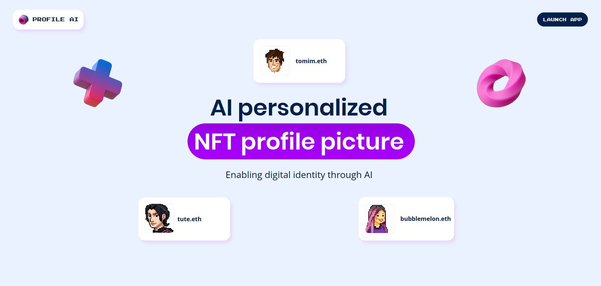
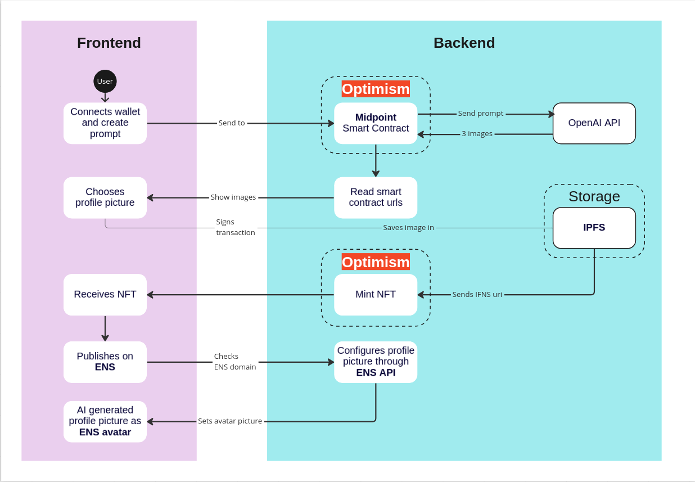
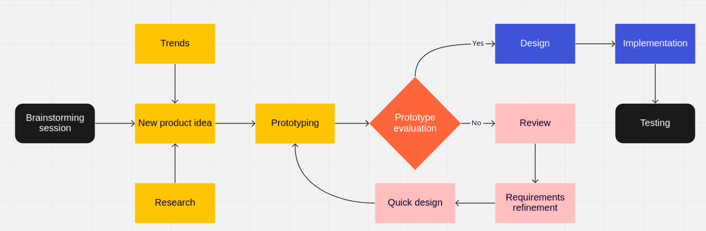

# Profile AI

Generates and mints AI profile image as NFTS for sale on chain. 

## 🎤 Pitch (The What)

Experience the seamless ownership of Non-Fungible Tokens (NTFs). An opportunity to be an early adopter of power of DallE 2 as a NFT for your digital identity. You now have the power to define your likenesss through this powerful AI system using natural language. Be part of the movement to in embracing ownership of rare, unusual, and unique goods.

<!--LINK TO VIDEO (Should look like a Thumbnail to a slide deck?) -->

## 📺 Demo (Delivery and Usage)

Youtube link: https://www.youtube.com/watch?v=yvZxAuUgpjA

1. Connect DApp with digital wallet.
2. Generate a prompt to describe the image.
3. Receive a choice of three image variations.
4. Instant ownership of a minted NFT 
5. Receive seemless intergration between the NFT to a ENS domain.

## 🏆 Our Motivation (The Why)

We want a frictionless way to obtain, own, a unique personalized NFT that had utitlity to service a public digital identity.

## 💼 Business Model

Price correlates with the number of calls to OpenAPI, using Optimism and gas fees a flat rate for using the service.

**For retail** 

- To generate the images, we charge $0.5 dollars ETH equivalent each time a set of images are retrieved from Open AI DALL-E 2.
    - Optimism gas fees cost: $0.006 approximately
    - OpenAI API cost: $0.002
- $0.5 - $0.006 - $0.00002x3 = $0.493 c

**For business**

- We give the opportunity to businesses and protocols to use our services to mint avatars for user's internal profiles, events and collections for a special cost:
    - $0.4 for 1000 Profile AI API call
    - $0.35 for 1000 to 5.000 Profile AI API call
    - $0.30 for 5000 to 10.000 Profile AI API call
    - $0.25 for every +10.000 Profile API call

## ⚒️ DApplication Structure (The How)

A React front end that requests a payload through [OpenAI](https://beta.openai.com/docs/introduction) using [Midpoint Labs](https://www.midpointapi.com/about) as a third party a hybrid backend. Midpoint labs provides the framweork for smart contract that houses the [DaLLE 2](https://openai.com/api/) program. This serves as end point to access the AI system that can create realistic images and art from a description in natural language. Images are minted using the [ERC 270 Token contract through Georli Optimism](https://community.optimism.io/docs/guides/testing/#erc-721-tokens). These NFTS are stored via [NFT.Storage](https://nft.storage/docs/concepts/gateways/#the-nftstorage-gateway). A service that leverages the [InterPlanetary File System (IPFS)](https://ipfs.tech/#why) as a key part of its storage and retrieval infrastructure. Users are seemlessly connected to the Ethereum Name Service (ENS) over the Etherium mainnet to retrieve their wallet address and link their newly minted NFT as their digital avatar.

## The Team

<!--  Who we are  -->

### Ideation

This is the general outline of our idea creation and workflow.

